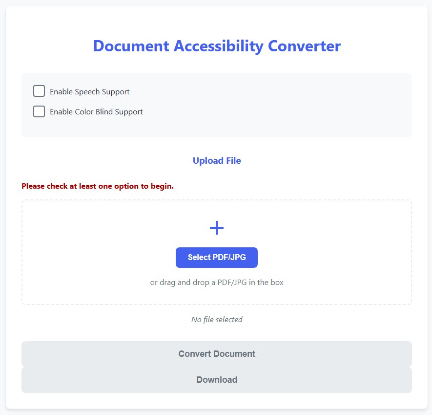

# perceptron.ai
Perceptron is an AI-powered EdTech solution that makes educational materials accessible. It enhances visual content for the colour blind, and converts text to audio for the visually impaired.

# 🔁 Prerequisites
- Python 3.10+  
- Node.js 16+ & npm/yarn  
- `poppler-utils` (for `pdf2image`)  
  - Ubuntu/debian: `sudo apt install poppler-utils`  
  - macOS (Homebrew): `brew install poppler`

# 🚀 Setup

## 1. Clone repository
```bash
git clone https://github.com/IanCheah/lifehack2025-imcooked.git
```

## 2. Backend setup
```bash
cd lifehack2025-imcooked
# Setup virtual environment
python3 -m venv .venv
# Activate virtual environment
source .venv/bin/activate # For MacOS
.venv\Scripts\activate # For Windows
# Install dependencies
cd backend
pip install -r requirements.txt
```

## 3. Frontend setup
From directory `lifehack2025-imcooked`:
```bash
cd lifehack2025
# Install dependencies
npm install
```

# 💻 Usage

## 1. Start backend server
From directory `lifehack2025-imcooked`:
```bash
cd backend
uvicorn main:app --reload
```

## 2. Start frontend server
From directory `lifehack2025-imcooked`:
```bash
cd lifehack2025
npm run dev
```

## 3. Navigate to UI
Open http://localhost:5713/ to use the converter.


# 🤝 Credits
[Dataset](https://www.kaggle.com/datasets/sakshivyavahare20/color-blindness-simulation-and-correction?resource=download) used for training CNN model are taken from kaggle.